# Customer Churn Intelligence System

An end-to-end churn analytics project that combines **SQL-based ETL, Power BI dashboards, and Python machine learning** to identify churn drivers, profile at-risk customers, and predict future churners.

This project is built as a **business decision system**, not just a notebook exercise. It translates raw customer data into actionable retention intelligence for marketing, product, and customer success teams.

---

## Business Problem

Customer churn is a direct revenue leak. When customers leave, the business loses recurring revenue, increases acquisition cost, and weakens long-term growth efficiency.

The core business questions behind this project were:

- Which customers are churning?
- Why are they churning?
- Which customers are most likely to churn next?
- What actions should the business take to reduce retention loss?

This project addresses those questions through a complete analytics workflow from raw data to business action.

---

## Project Objectives

- Build a structured ETL pipeline in SQL
- Create clean analysis-ready views for churn and new joiners
- Analyze churn by:
  - Demographics
  - Geography
  - Payment and account behavior
  - Services used
- Profile churners for retention campaigns
- Build a predictive model to identify future churners
- Deliver an executive-ready Power BI dashboard

---

## Dataset Overview

| Metric | Value |
|---|---:|
| Total Customers | 6,418 |
| Stayed | 4,275 |
| Churned | 1,732 |
| Joined | 411 |
| Churn Rate | 27.0% |

### Data Sources

- `data/raw/Customer_Data.csv` — source dataset
- `sql/eda_exploration.sql` — exploratory SQL analysis
- `sql/create_views.sql` — ETL and view creation
- `data/processed/churn_model_input.xlsx` — model-ready dataset
- `notebooks/churn_prediction_model.ipynb` — prediction workflow
- `data/output/Predictions.csv` — churn prediction output
- `powerbi/churn_analysis.pbix` — final dashboard
- `videos/project overview.mp4` — walkthrough of the dashboard and project

---

## Tools & Technologies

- **SQL Server** for ETL and data modeling
- **Power BI** for dashboarding and reporting
- **Python** for machine learning
- **Pandas / NumPy** for data preparation
- **Scikit-learn** for model training and evaluation
- **Matplotlib / Seaborn** for visualization

---

## Data Preparation & ETL

The raw customer data was transformed into two production-style views:

- `vw_churndata` → customers with `Stayed` and `Churned` status
- `vw_joindata` → customers with `Joined` status

This separation made the project usable for two workflows:

1. **Historical churn analysis**
2. **Future churn prediction**

The ETL layer standardized the data, handled missing values, and created a clean structure for reporting and modeling.

---

## Key Business Findings

### 1. Contract Type Is a Major Churn Driver
Month-to-month customers showed the highest churn rate at **46.5%**, while two-year customers had only **2.7%** churn.  
This is one of the strongest signals in the project and directly points to contract conversion as a retention lever.

### 2. Tenure Matters
Customers in the **6–12 month tenure window** were a critical risk group.  
This is the stage where onboarding benefits fade and retention risk becomes visible.

### 3. Service Type Influences Churn
Customers using **fiber optic internet** showed higher churn than other internet types.  
That suggests service experience, value perception, and support quality matter significantly.

### 4. Churn Is Competitor-Driven
A large share of churn was linked to competitor offers, especially:
- better devices
- better offers
- more data
- higher download speeds

This shows churn is not only a pricing problem — it is also a competitive value problem.

### 5. Risk Is Not Random
Churn risk clusters around:
- specific states
- specific age bands
- specific contract types
- short-to-mid tenure customers
- certain payment methods

This makes targeted retention possible.

---

## Power BI Dashboard Summary

### Summary Dashboard
The summary dashboard gives the executive view of the business:

- Total Customers: **6,418**
- Total Churn: **1,732**
- New Joiners: **411**
- Churn Rate: **27.0%**

It also breaks churn down by:
- gender
- age group
- geography
- payment method
- contract type
- tenure group
- churn reason
- services used

### Prediction Dashboard
The prediction dashboard focuses on action:

- Identifies customers at risk
- Shows churner profile by state, tenure, age group, payment method, and contract
- Provides a customer-at-risk table with revenue and referral fields
- Supports interactive filtering for decision-making

---

## Machine Learning Model

The churn prediction model was built using a **Random Forest Classifier**.

### Model Performance
- **Accuracy:** ~87%
- **Precision (Churn class):** 0.81
- **Recall (Churn class):** 0.67

### Interpretation
The model is strong enough to support business targeting.  
It is especially useful where the goal is to **prioritize likely churners for retention action**, not to predict with absolute certainty.

### Top Predictive Features
- Total Revenue
- Contract Type
- Total Charges
- Monthly Charge
- Total Long Distance Charges
- Tenure
- State
- Number of Referrals
- Internet Type

These features align with the business story shown in the dashboards.

---

## Business Recommendations

### 1. Target Month-to-Month Customers First
Customers on month-to-month plans are the highest-risk segment.  
Offer:
- contract conversion discounts
- loyalty incentives
- bundled service upgrades

### 2. Strengthen Early-Tenure Retention
The first 6–12 months are critical.  
Use:
- onboarding support
- proactive check-ins
- service education
- issue resolution campaigns

### 3. Compete on Value, Not Just Price
Competitor-related churn suggests a market value gap.  
Focus on:
- better bundles
- stronger offers
- clearer product positioning
- retention campaigns for high-risk users

### 4. Improve Service Experience
Fiber optic and support-related churn indicates service quality matters.  
Improve:
- reliability
- service responsiveness
- customer support resolution time

### 5. Use Predictive Scoring Operationally
The prediction model should be used in CRM or retention workflows to:
- flag high-risk customers
- prioritize outreach
- reduce retention cost
- improve campaign ROI

---

## Screenshots

### Summary Dashboard
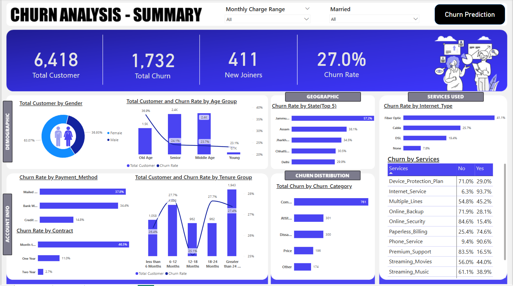

### Summary Dashboard Filtered Views
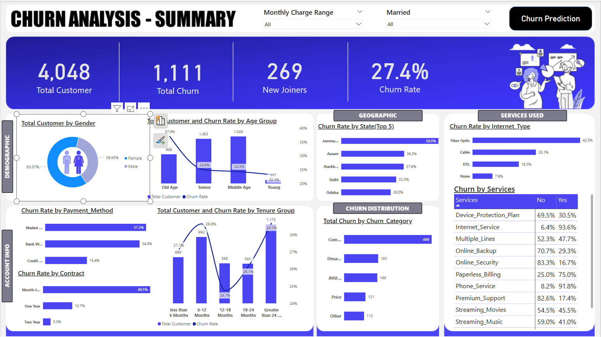  
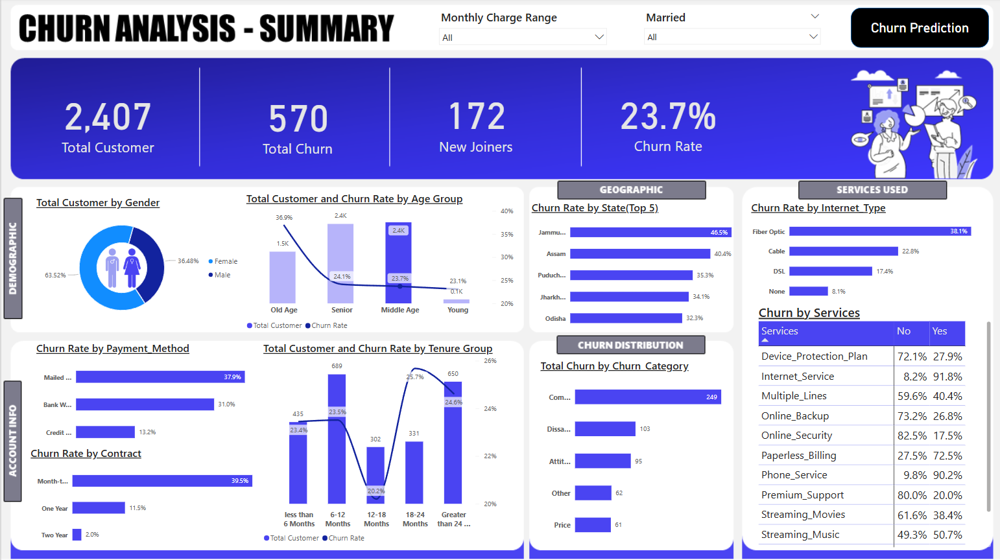  
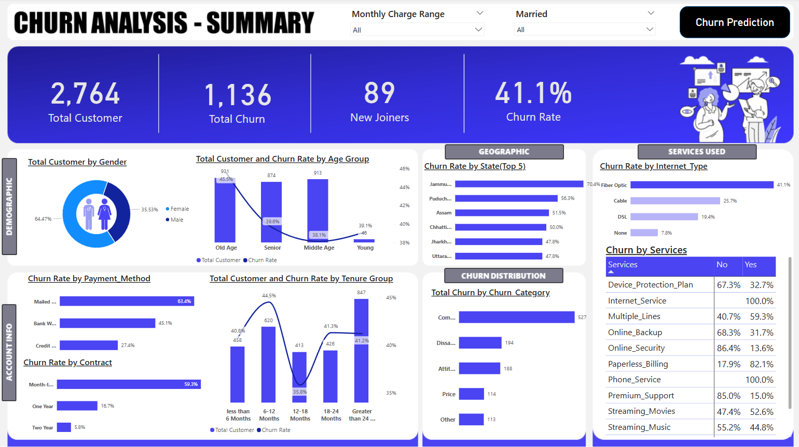

### Churn Reason Drilldown
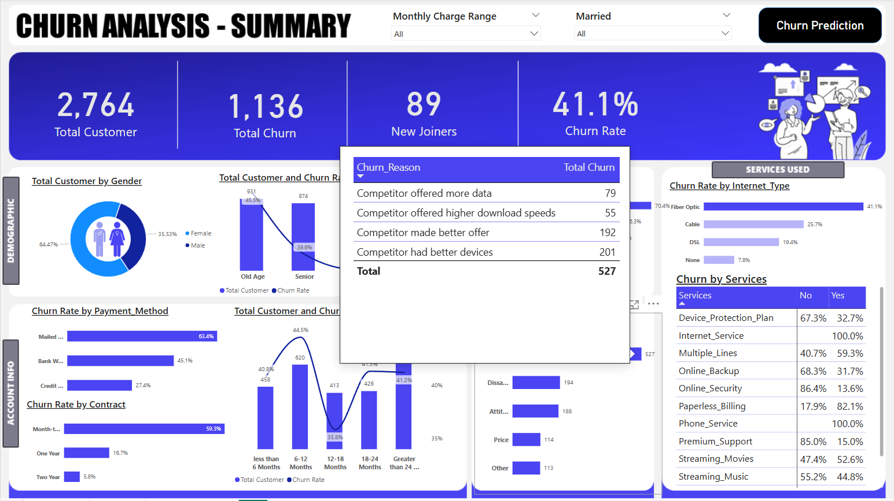

### Prediction Dashboard
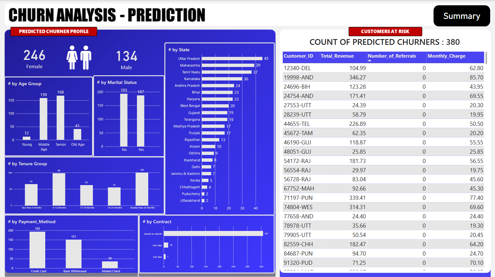  
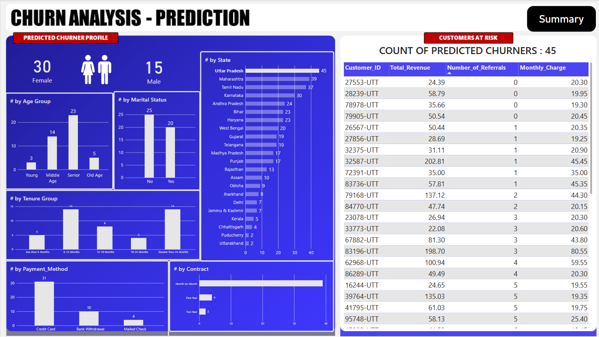  
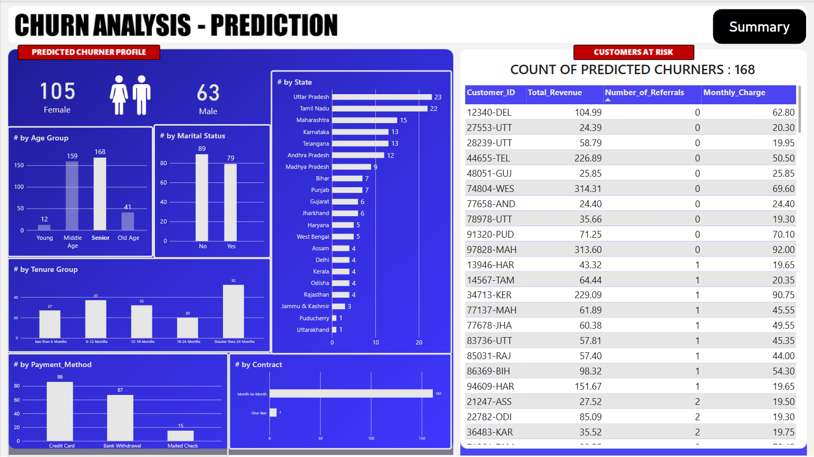  
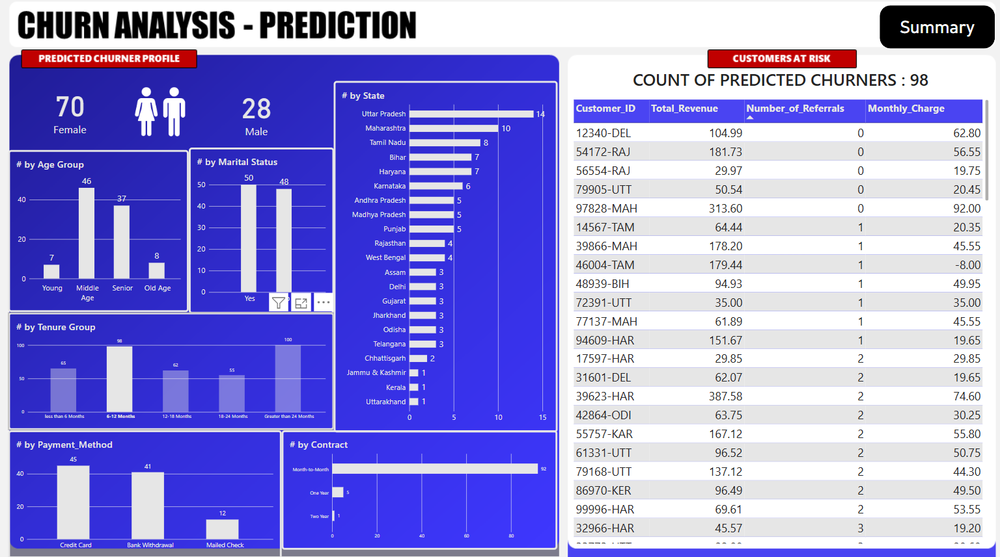  
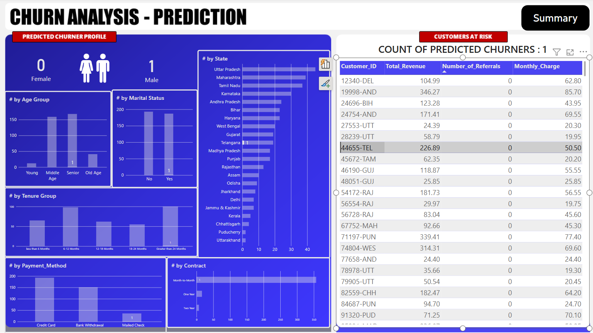

### Model Outputs
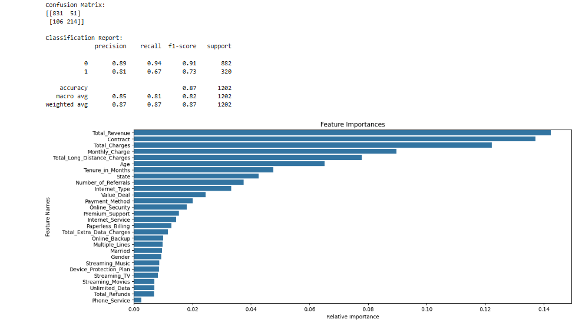

---

## Repository Structure
```
telecom-churn-analysis/
├── data/
│   ├── raw/
│   │   └── Customer_Data.csv
│   ├── processed/
│   │   └── churn_model_input.xlsx
│   └── output/
│       └── Predictions.csv
├── notebooks/
│   └── churn_prediction_model.ipynb
├── powerbi/
│   └── churn_analysis.pbix
├── screenshots/
│   ├── summary_dashboard_overall.png
│   ├── summary_dashboard_filtered_female.png
│   ├── summary_dashboard_filtered_agegroup.png
│   ├── summary_dashboard_filtered_internet_type.png
│   ├── summary_dashboard_churn_reason_drilldown.png
│   ├── prediction_dashboard_overview.png
│   ├── prediction_dashboard_filtered_state.png
│   ├── prediction_dashboard_filtered_agegroup.png
│   ├── prediction_dashboard_filtered_tenuregroup.png
│   ├── prediction_filtered_count_of_predicted_churner.png
│   └── model_confusion_matrix_feature_importance.png
├── sql/
│   ├── create_views.sql
│   └── eda_exploration.sql
├── videos/
│   └── project overview.mp4
└── README.md
```

## Project Impact

This project gives the business a practical churn intelligence system that can be used to:

- reduce revenue leakage
- target retention spending more efficiently
- prioritize high-risk customers
- improve campaign ROI
- support data-driven customer success decisions

## Conclusion

This project demonstrates an end-to-end churn analytics workflow from raw data to business action.  
It combines ETL, dashboarding, segmentation, and predictive modeling to answer the most important retention question:

**Which customers are at risk, why are they at risk, and what should the business do next?**
